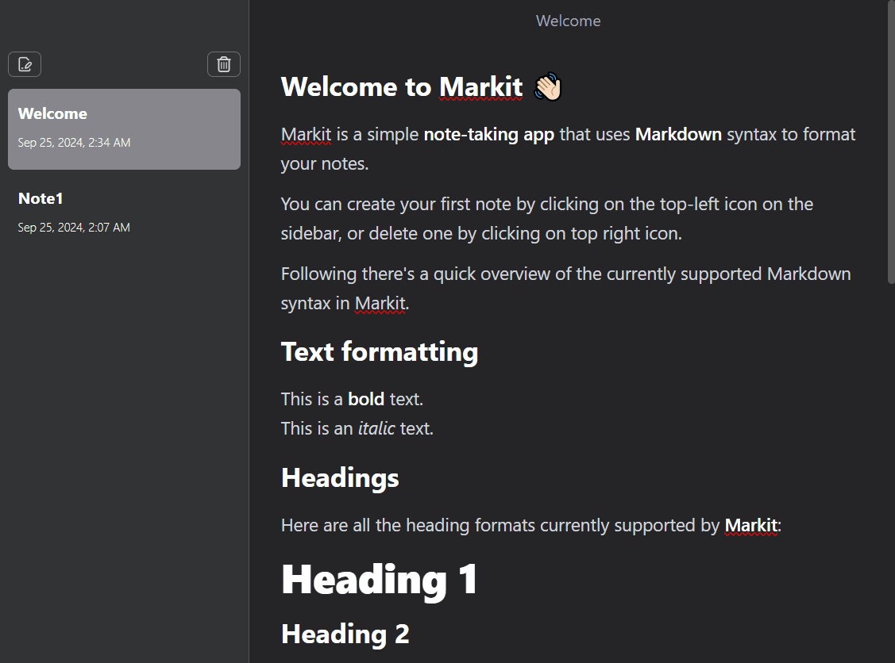

# Mark-it

Mark-it is a simple **note-taking app** that uses **Markdown** syntax to format your notes.

<div style="text-align: center;">
    
</div>

## Features

- Create, edit, and delete notes in Markdown format.
- Automatically creates a Welcome Note on first launch.
- Real-time update of the note list after operations (create, delete, etc.).
- Electron-based file system access ensures notes are saved locally.
- Ensures notes are only saved in the designated app directory.
- Light-weight and fast with Vite build system.

## Setup and Installation

1. **Clone the Repository**

   ```bash
   git clone https://github.com/7ossam7atem1/Mark-it.git
   cd mark-it
   ```

## Recommended IDE Setup

- [VSCode](https://code.visualstudio.com/) + [ESLint](https://marketplace.visualstudio.com/items?itemName=dbaeumer.vscode-eslint) + [Prettier](https://marketplace.visualstudio.com/items?itemName=esbenp.prettier-vscode)

## Project Setup

### Install

```bash
$ yarn
```

### Development

```bash
$ yarn dev
```

### Build

```bash
# For windows
$ yarn build:win

# For macOS
$ yarn build:mac

# For Linux
$ yarn build:linux
```
