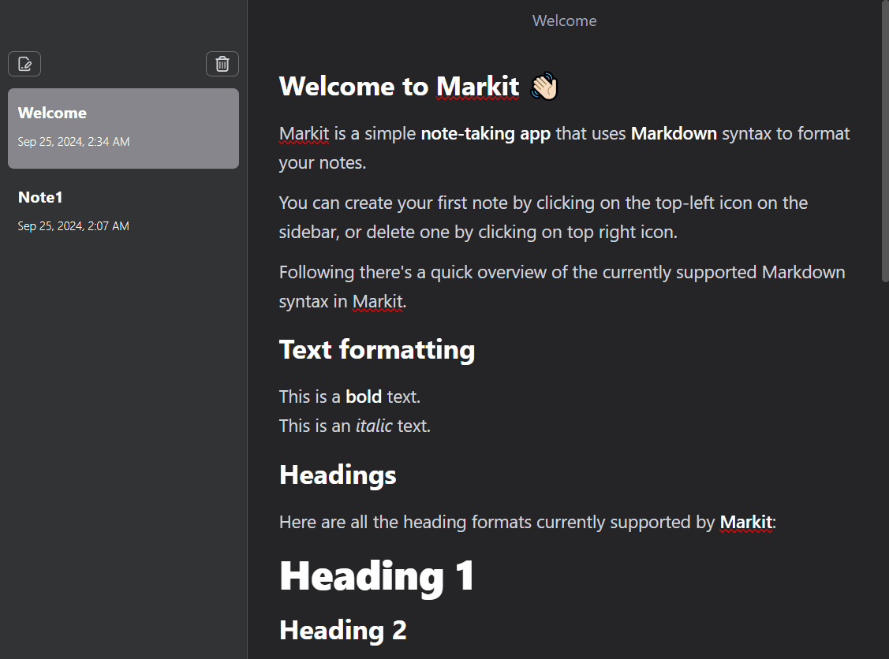

# 📝 Mark-it

<div align="center">


**A modern, lightweight note-taking application built with Electron, React, and TypeScript**

[Features](#-features) • [Installation](#-installation) • [Usage](#-usage) • [Development](#-development) • [Building](#-building)

</div>

---

<div align="center">
    
</div>

## 📋 Table of Contents

- [About](#-about)
- [Features](#-features)
- [Tech Stack](#-tech-stack)
- [Prerequisites](#-prerequisites)
- [Installation](#-installation)
- [Usage](#-usage)
- [Development](#-development)
- [Building](#-building)
- [Project Structure](#-project-structure)
- [Scripts](#-scripts)
- [Recommended IDE Setup](#-recommended-ide-setup)
- [Contributing](#-contributing)
- [License](#-license)

## 🎯 About

**Mark-it** is a cross-platform desktop application for taking and managing notes using Markdown syntax. Built with modern web technologies, it provides a fast, intuitive, and distraction-free writing experience. All notes are stored locally on your machine, ensuring your data remains private and secure.

## ✨ Features

- **📝 Markdown Support** - Write notes using Markdown syntax with real-time preview
- **⚡ Fast & Lightweight** - Built with Vite for optimal performance and quick startup times
- **💾 Local Storage** - All notes are saved locally on your device, ensuring privacy and security
- **🔄 Real-time Updates** - Note list updates instantly after create, edit, or delete operations
- **🎨 Modern UI** - Clean, minimalist interface built with Tailwind CSS
- **🚀 Cross-platform** - Available for Windows, macOS, and Linux
- **📱 Responsive Design** - Optimized window size and layout for comfortable note-taking
- **🎁 Welcome Note** - Automatically creates a welcome note on first launch to help you get started
- **🔒 Secure** - Electron-based file system access with sandboxed renderer process
- **📂 Organized** - Notes are automatically saved in a designated app directory

## 🛠 Tech Stack

### Core Technologies
- **[Electron](https://www.electronjs.org/)** - Cross-platform desktop application framework
- **[React](https://react.dev/)** - UI library for building user interfaces
- **[TypeScript](https://www.typescriptlang.org/)** - Typed superset of JavaScript
- **[Vite](https://vitejs.dev/)** - Next-generation frontend build tool

### UI & Styling
- **[Tailwind CSS](https://tailwindcss.com/)** - Utility-first CSS framework
- **[MDX Editor](https://mdxeditor.dev/)** - Rich Markdown editing experience
- **[React Icons](https://react-icons.github.io/react-icons/)** - Popular icons library

### State Management & Utilities
- **[Jotai](https://jotai.org/)** - Primitive and flexible state management
- **[Lodash](https://lodash.com/)** - JavaScript utility library

### Development Tools
- **[ESLint](https://eslint.org/)** - Code linting
- **[Prettier](https://prettier.io/)** - Code formatting
- **[Electron Builder](https://www.electron.build/)** - Application packaging and distribution

## 📦 Prerequisites

Before you begin, ensure you have the following installed on your system:

- **Node.js** (v18 or higher recommended)
- **Yarn** (v1.22.22 or higher) - Package manager
- **Git** - Version control system

### Installing Prerequisites

**Node.js:**
- Download from [nodejs.org](https://nodejs.org/)
- Or use a version manager like [nvm](https://github.com/nvm-sh/nvm)

**Yarn:**
```bash
npm install -g yarn
```

## 🚀 Installation

1. **Clone the repository**
   ```bash
   git clone https://github.com/7ossam7atem1/Mark-it.git
   cd Mark-it
   ```

2. **Install dependencies**
   ```bash
   yarn install
   ```

3. **Install Electron app dependencies** (automatically runs after `yarn install` via postinstall script)
   ```bash
   npx electron-builder install-app-deps
   ```

## 💻 Usage

### Running in Development Mode

Start the development server with hot module replacement:

```bash
yarn dev
```

This will:
- Start the Electron application
- Enable hot module replacement (HMR) for fast development
- Open the application window automatically

### Running Production Build

Build and preview the production version:

```bash
yarn build
yarn start
```

## 🔧 Development

### Available Scripts

| Command | Description |
|---------|-------------|
| `yarn dev` | Start development server with HMR |
| `yarn build` | Build the application for production |
| `yarn start` | Preview production build |
| `yarn lint` | Run ESLint and fix issues |
| `yarn format` | Format code with Prettier |
| `yarn typecheck` | Run TypeScript type checking |
| `yarn typecheck:node` | Type check Node.js code |
| `yarn typecheck:web` | Type check web/renderer code |

### Development Workflow

1. Make your changes in the `src/` directory
2. The application will automatically reload with your changes (HMR)
3. Run `yarn lint` to check for code issues
4. Run `yarn format` to format your code
5. Run `yarn typecheck` to verify TypeScript types

## 📦 Building

Build distributable packages for different platforms:

### Windows
```bash
yarn build:win
```

### macOS
```bash
yarn build:mac
```

### Linux
```bash
yarn build:linux
```

### Unpacked Build (for testing)
```bash
yarn build:unpack
```

Built applications will be available in the `dist/` directory.

## 📁 Project Structure

```
Mark-it/
├── build/                 # Build configuration and assets
│   ├── icon.icns         # macOS icon
│   ├── icon.ico          # Windows icon
│   ├── icon.png          # Linux icon
│   └── entitlements.mac.plist
├── resources/            # Application resources
│   ├── Animation.gif     # Demo animation
│   ├── icon.png          # Application icon
│   └── welcomeNote.md    # Welcome note template
├── src/
│   ├── main/             # Electron main process
│   │   ├── index.ts      # Main entry point
│   │   └── lib/          # Main process utilities
│   ├── preload/          # Preload scripts
│   │   ├── index.ts      # Preload script
│   │   └── index.d.ts    # Type definitions
│   ├── renderer/         # React renderer process
│   │   ├── index.html    # HTML template
│   │   └── src/
│   │       ├── components/   # React components
│   │       ├── hooks/        # Custom React hooks
│   │       ├── store/        # State management
│   │       ├── utils/        # Utility functions
│   │       └── main.tsx      # React entry point
│   └── shared/           # Shared types and constants
├── electron-builder.yml   # Electron Builder configuration
├── electron.vite.config.ts # Vite configuration
├── package.json          # Project dependencies and scripts
├── tailwind.config.js    # Tailwind CSS configuration
└── tsconfig.json         # TypeScript configuration
```

## 💡 Recommended IDE Setup

For the best development experience, we recommend using:

- **[VS Code](https://code.visualstudio.com/)** - Popular code editor
- **[ESLint Extension](https://marketplace.visualstudio.com/items?itemName=dbaeumer.vscode-eslint)** - Real-time linting
- **[Prettier Extension](https://marketplace.visualstudio.com/items?itemName=esbenp.prettier-vscode)** - Code formatting
- **[TypeScript Extension](https://marketplace.visualstudio.com/items?itemName=ms-vscode.vscode-typescript-next)** - TypeScript support

### VS Code Settings

Add these to your `.vscode/settings.json`:

```json
{
  "editor.formatOnSave": true,
  "editor.defaultFormatter": "esbenp.prettier-vscode",
  "editor.codeActionsOnSave": {
    "source.fixAll.eslint": true
  }
}
```

## 🤝 Contributing

Contributions are welcome! If you'd like to contribute to Mark-it:

1. Fork the repository
2. Create a feature branch (`git checkout -b feature/amazing-feature`)
3. Commit your changes (`git commit -m 'Add some amazing feature'`)
4. Push to the branch (`git push origin feature/amazing-feature`)
5. Open a Pull Request

Please ensure your code:
- Follows the existing code style
- Passes all linting checks (`yarn lint`)
- Is properly formatted (`yarn format`)
- Has no TypeScript errors (`yarn typecheck`)

## 📄 License

This project is open source and available under the [MIT License](LICENSE).

